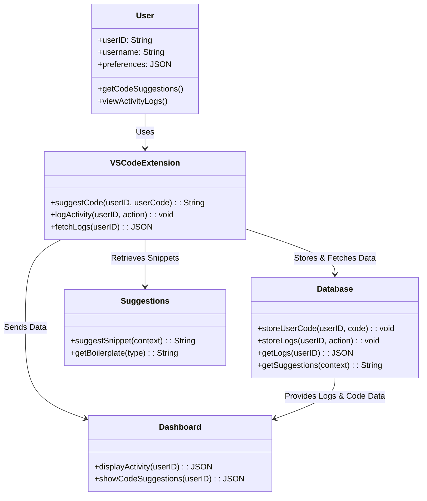

# Class Diagrams

## Front End Diagram

## Back End Diagram
classDiagram
    class User {
        +String userId
        +String username
        +String email
    }

    class CodeSession {
        +String sessionId
        +String userId
        +String codeContent
        +Date lastUpdated
    }

    class Suggestion {
        +String suggestionId
        +String sessionId
        +String suggestedCode
        +String explanation
        +Date timestamp
    }

    class MongoDB {
        +storeCodeSession(sessionId, userId, codeContent)
        +retrieveCodeSession(sessionId)
        +storeSuggestion(suggestionId, sessionId, suggestedCode, explanation)
    }

    class OpenAI_LLM {
        +generateCodeSuggestion(codeContent) 
    }

    class BackendAPI {
        +saveCode(userId, codeContent)
        +fetchCode(sessionId)
        +requestSuggestion(sessionId)
    }

    User "1" -- "many" CodeSession : owns
    CodeSession "1" -- "many" Suggestion : has
    CodeSession "1" -- "1" MongoDB : stored_in
    Suggestion "1" -- "1" MongoDB : stored_in
    BackendAPI "1" -- "1" MongoDB : interacts_with
    BackendAPI "1" -- "1" OpenAI_LLM : requests_suggestions
    OpenAI_LLM "1" -- "many" Suggestion : generates
### Server

### Database

### OpenAI
