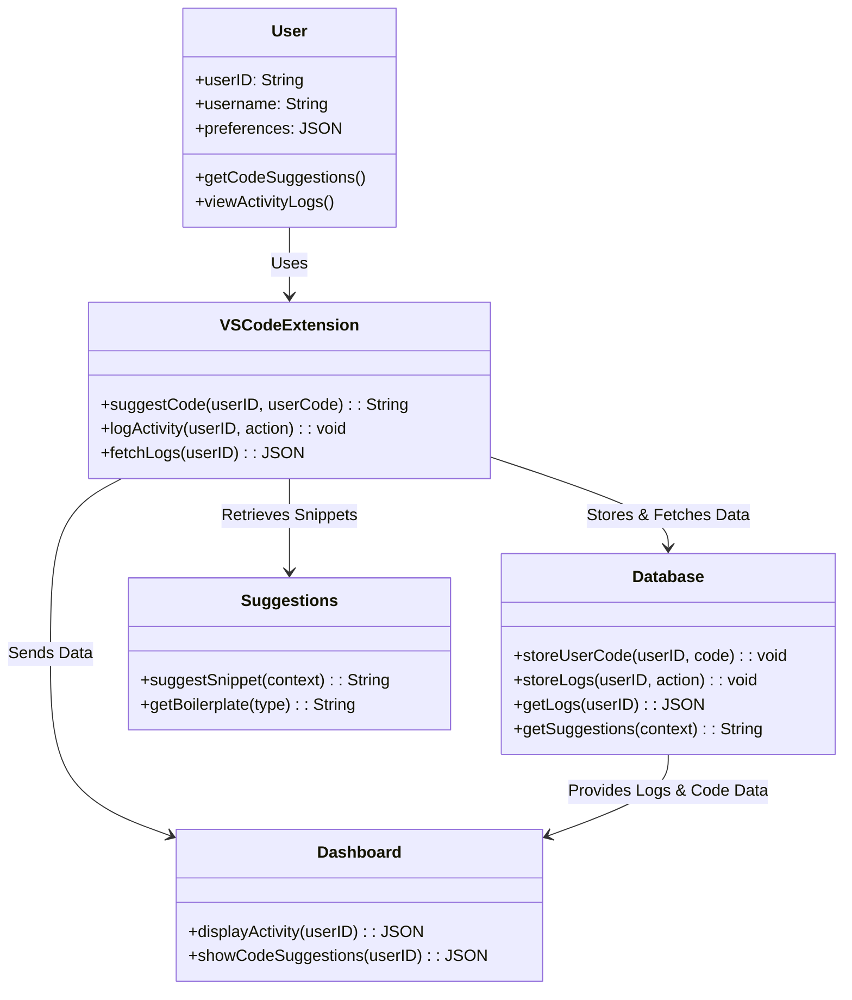

# Class Diagrams

## Front End Diagram

```mermaid

classDiagram
    direction TB

    class User {
        +userID: String
        +username: String
        +preferences: JSON
        +getCodeSuggestions()
        +viewActivityLogs()
    }

    class VSCodeExtension {
        +suggestCode(userID, userCode): String
        +logActivity(userID, action): void
        +fetchLogs(userID): JSON
    }

    class Database {
        +storeUserCode(userID, code): void
        +storeLogs(userID, action): void
        +getLogs(userID): JSON
        +getSuggestions(context): String
    }

    class Suggestions {
        +suggestSnippet(context): String
        +getBoilerplate(type): String
    }

    class Dashboard {
        +displayActivity(userID): JSON
        +showCodeSuggestions(userID): JSON
    }

    User --> VSCodeExtension : Uses
    VSCodeExtension --> Database : Stores & Fetches Data
    VSCodeExtension --> Suggestions : Retrieves Snippets
    VSCodeExtension --> Dashboard : Sends Data
    Database --> Dashboard : Provides Logs & Code Data


```
## Back End Diagram

### Server

### Database

### OpenAI
