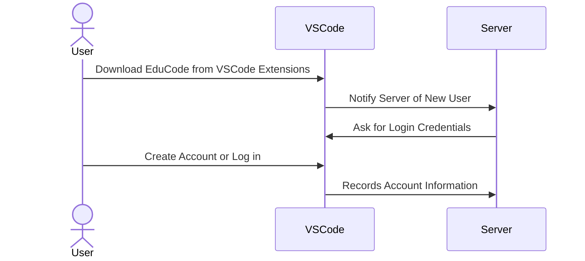
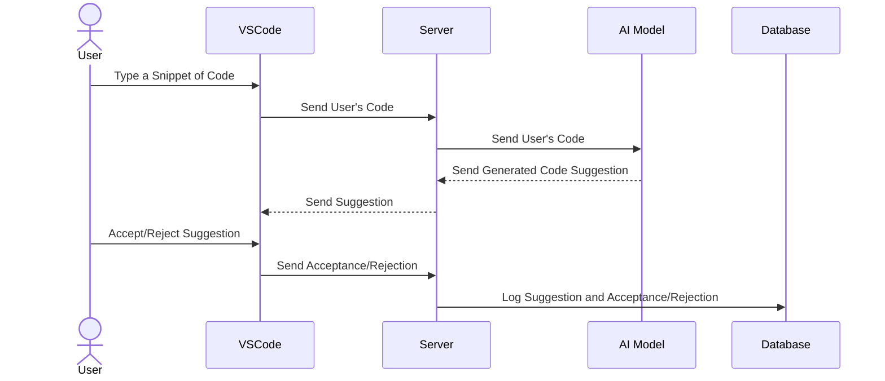
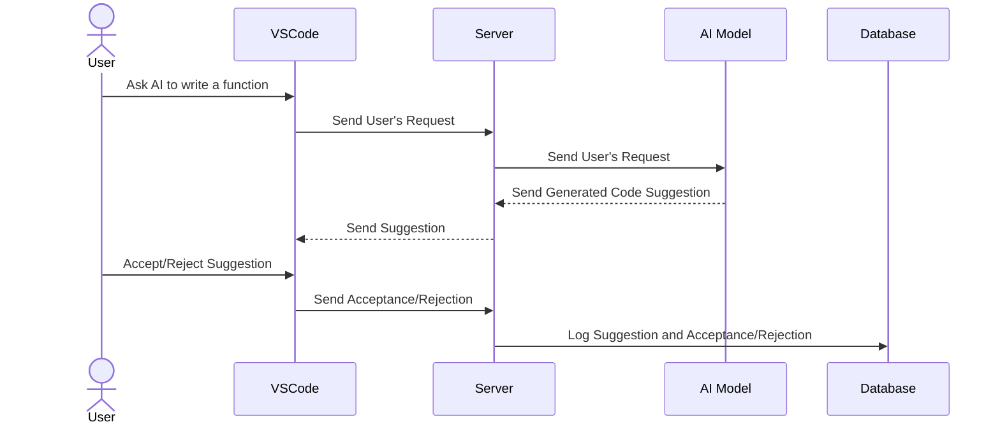
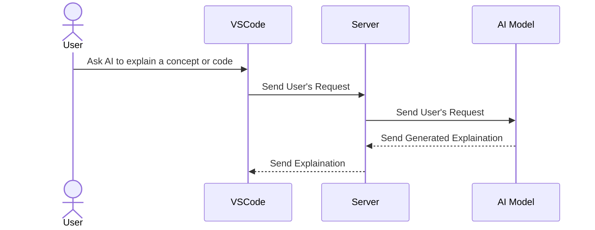
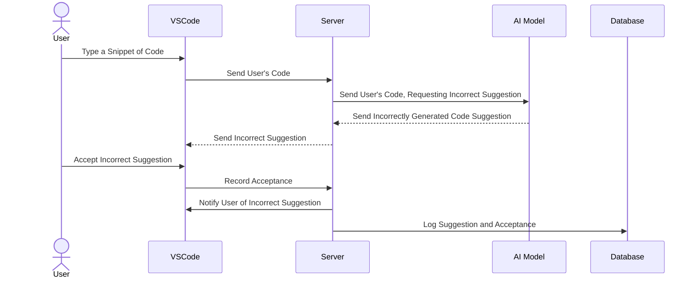
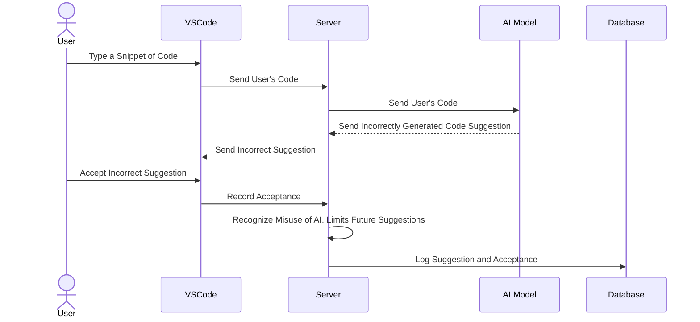
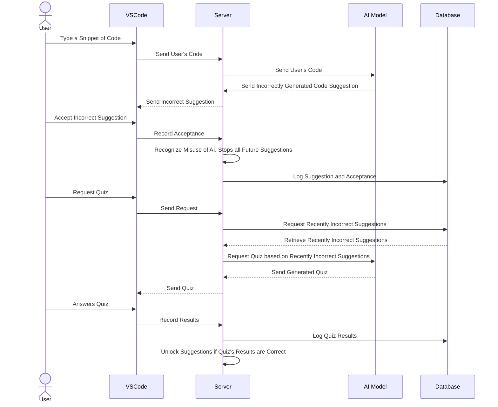
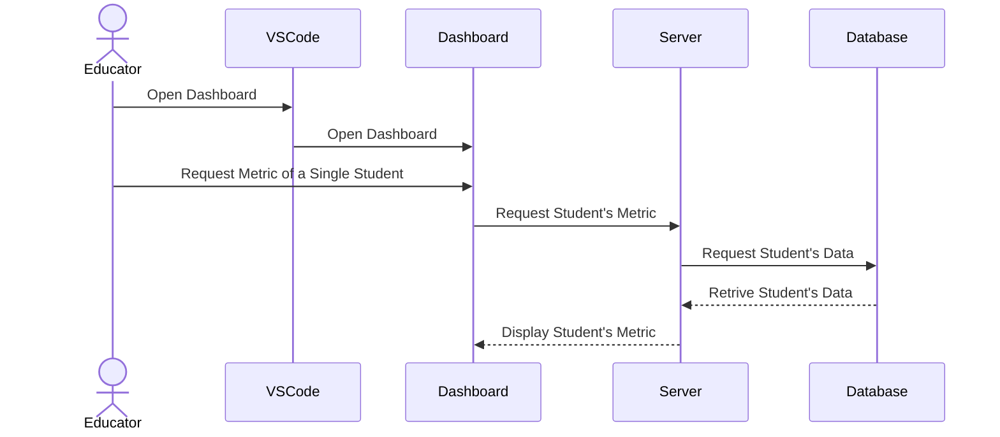
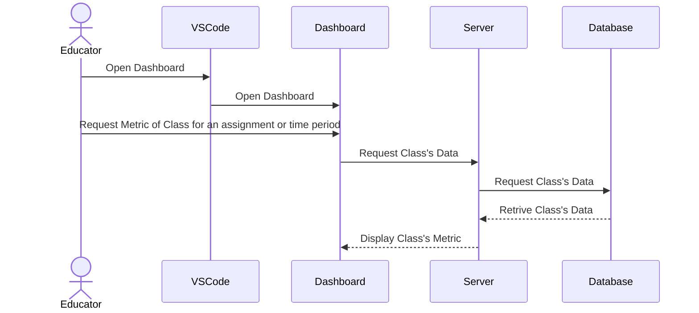
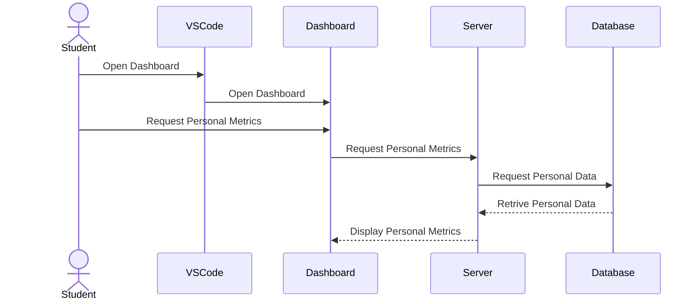

# Sequence Diagrams

## Use Case 1
**User signs into EduCode for school as educator or student**

## Use Case 2
**Student uses EduCode to autocomplete written code**

## Use Case 3
**Student uses EduCode to ask AI to write a complete function for them**

## Use Case 4
**Student uses EduCode to ask AI to explain a concept or code**

## Use Case 5
**Student is provided an inaccurate suggestion**

## Use Case 6
**System recognizes student is misusing AI assiantance and limits suggestions**

## Use Case 7
**Student is given a Mini-Quiz to unlock suggestions again**

## Use Case 8
**Educator views Metrics for single student**

## Use Case 9
**Educator views Metrics for class for an assignment or time period**

## Use Case 10
**Student views metrics for their own AI use**
